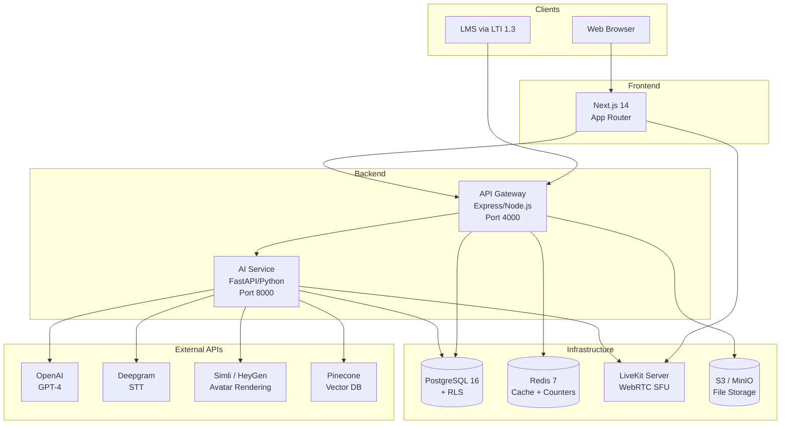
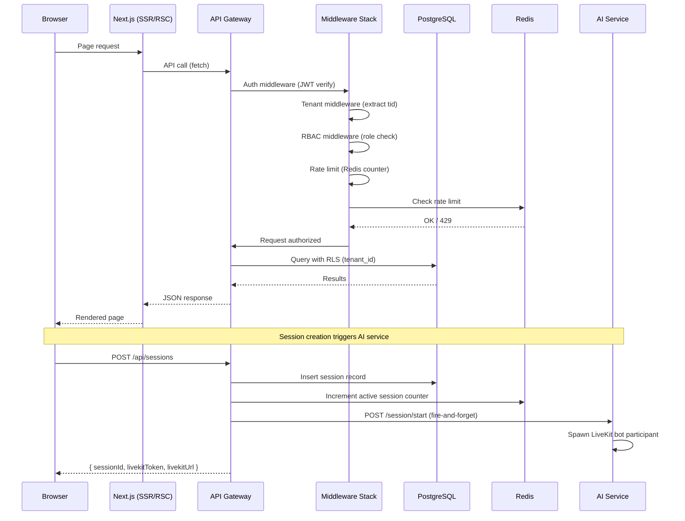
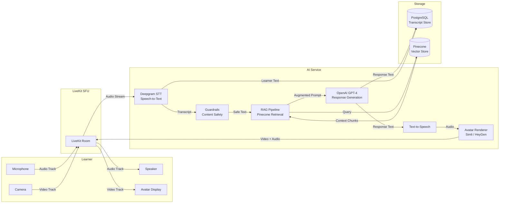
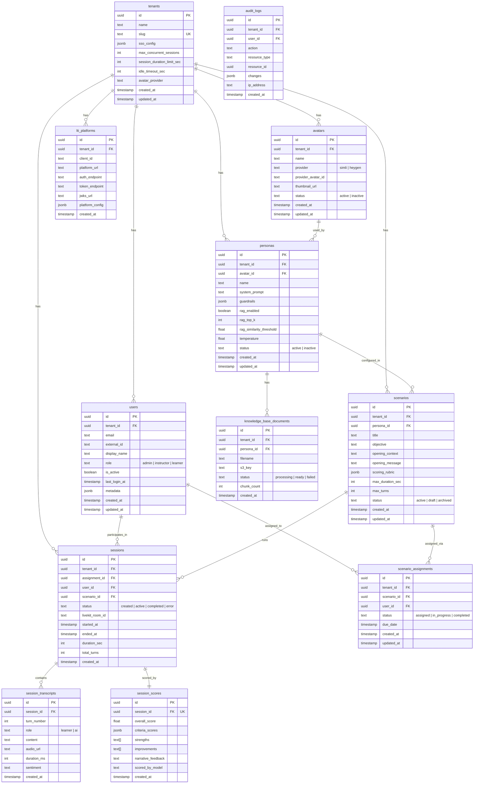
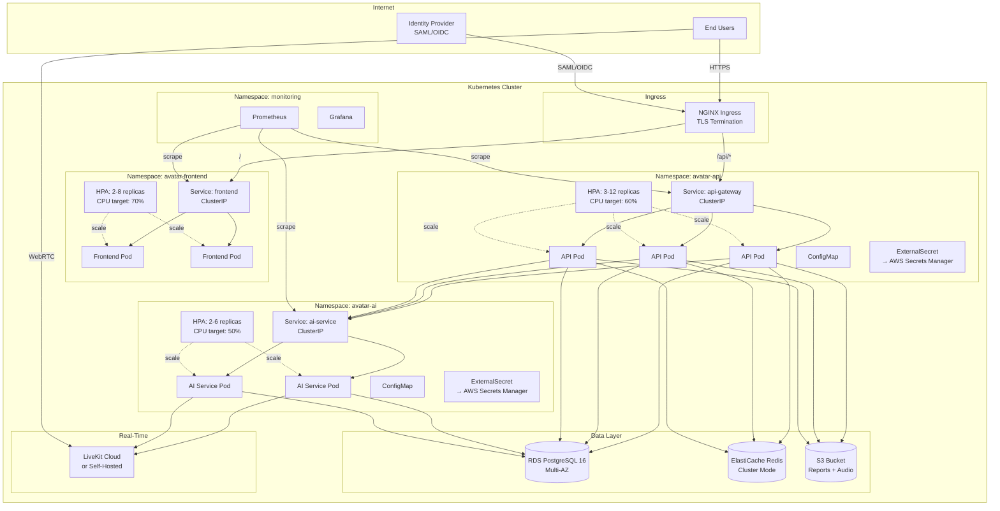
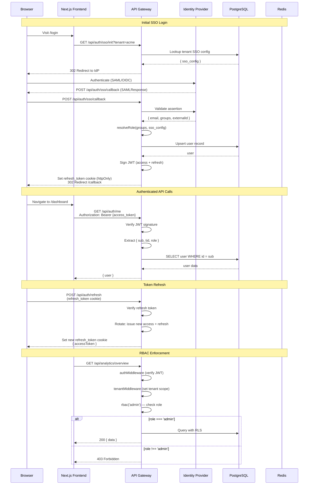

# AI Avatar Training Platform — Architecture

> **Last updated:** 2026-03-18

---

## Table of Contents

1. [System Overview](#system-overview)
2. [Monorepo Structure](#monorepo-structure)
3. [Request Flow](#request-flow)
4. [Real-Time Pipeline](#real-time-pipeline)
5. [Database Schema](#database-schema)
6. [Deployment Architecture](#deployment-architecture)
7. [Authentication Flow](#authentication-flow)

---

## System Overview

The AI Avatar Training Platform enables learners to practice conversations with AI-powered avatars in realistic training scenarios. Instructors configure personas and scenarios; learners interact via real-time video/audio; the system scores performance against rubrics.



---

## Monorepo Structure

The project uses a pnpm workspace monorepo managed by Turborepo.

```
ai-avatar-training-platform/
├── apps/
│   ├── web/              # Next.js 14 frontend (App Router)
│   │   └── src/app/
│   │       ├── (learner)/    # Learner routes (session, dashboard)
│   │       └── (admin)/      # Admin routes (personas, scenarios, analytics)
│   ├── api/              # Express API gateway (Node.js)
│   │   └── src/
│   │       ├── routes/       # auth, session, avatar, persona, scenario, analytics, lti
│   │       ├── middleware/   # auth, rbac, tenant, rate-limit, validation
│   │       ├── services/     # jwt, sso, s3, pdf, user, role-resolver
│   │       ├── db/           # migrations (001-016), seed data
│   │       └── config/       # env, database, redis, livekit, logger
│   └── ai-service/       # FastAPI AI/ML service (Python)
│       └── src/
│           ├── session/      # Session orchestration, STT/TTS pipeline
│           ├── scoring/      # Rubric-based LLM scoring
│           ├── rag/          # Document embedding, retrieval
│           └── guardrails/   # Content safety, topic boundaries
├── packages/
│   └── shared/           # Shared TypeScript types and utilities
├── k8s/                  # Kubernetes manifests
│   ├── api/              # API deployment, service, HPA, configmap, external-secret
│   ├── ai/               # AI service deployment, service, HPA, configmap, external-secret
│   ├── frontend/         # Frontend deployment, service, HPA, configmap
│   ├── monitoring/       # Prometheus, Grafana configs
│   ├── ingress.yaml      # NGINX Ingress rules
│   ├── namespaces.yaml   # Namespace definitions
│   └── network-policies.yaml
├── tests/
│   └── load/             # k6 load testing scripts
├── docker-compose.yml    # Local development stack
├── turbo.json            # Turborepo pipeline config
└── pnpm-workspace.yaml   # Workspace definition
```

---

## Request Flow

Standard API request lifecycle from browser to response.



---

## Real-Time Pipeline

During an active training session, audio/video flows through LiveKit with AI processing.



### Pipeline Stages

1. **Capture:** Learner's microphone audio is published as a WebRTC track to the LiveKit room.
2. **STT (Speech-to-Text):** The AI service bot subscribes to the learner's audio track and streams it to Deepgram for real-time transcription.
3. **Guardrails:** Transcribed text passes through content safety checks and topic boundary enforcement.
4. **RAG (Retrieval-Augmented Generation):** If enabled for the persona, relevant knowledge base chunks are retrieved from Pinecone based on the conversation context.
5. **LLM:** The system prompt, conversation history, RAG context, and guardrail instructions are sent to GPT-4 for response generation.
6. **TTS + Avatar:** The response text is converted to speech and rendered as a talking avatar video stream via Simli or HeyGen.
7. **Publish:** The avatar video/audio track is published back to the LiveKit room for the learner.
8. **Store:** Both learner and AI turns are persisted to the `session_transcripts` table.

---

## Database Schema

PostgreSQL 16 with Row-Level Security (RLS) for multi-tenant data isolation.



### Key Design Decisions

- **UUIDv7** primary keys for natural time-ordering and globally unique identifiers.
- **Row-Level Security (RLS)** on all tenant-scoped tables ensures data isolation at the database level.
- **`tenant_id`** is present on every row and enforced by RLS policies — queries always filter by tenant.
- **`scoring_rubric`** is stored as JSONB on `scenarios`, containing an array of `{ criterion_name, weight, description }`.
- **`criteria_scores`** on `session_scores` is JSONB matching the rubric structure with actual scores.

---

## Deployment Architecture

Kubernetes deployment across four namespaces with Horizontal Pod Autoscalers.



### Network Policies

- **avatar-frontend** can only egress to `avatar-api` (API calls).
- **avatar-api** can egress to `avatar-ai`, PostgreSQL, Redis, and S3.
- **avatar-ai** can egress to external APIs (OpenAI, Deepgram, Simli), LiveKit, and PostgreSQL.
- **monitoring** can ingress from all namespaces (metrics scraping).

### Autoscaling Targets

| Service | Min Replicas | Max Replicas | CPU Target | Memory Limit |
|---------|-------------|-------------|------------|--------------|
| Frontend | 2 | 8 | 70% | 512Mi |
| API Gateway | 3 | 12 | 60% | 1Gi |
| AI Service | 2 | 6 | 50% | 2Gi |

---

## Authentication Flow

SSO-based authentication with JWT access/refresh token rotation.



### Token Details

| Token | Type | Storage | Lifetime | Purpose |
|-------|------|---------|----------|---------|
| Access Token | JWT (signed) | Memory / URL fragment | 15 minutes | API authorization; contains `sub`, `tid`, `role` |
| Refresh Token | Opaque | httpOnly cookie (`/api/auth` path) | 7 days | Obtain new access tokens without re-authentication |

### RBAC Roles

| Role | Permissions |
|------|-------------|
| `admin` | Full access: manage tenants, users, personas, scenarios, analytics |
| `instructor` | Manage personas, scenarios, view analytics, assign scenarios to learners |
| `learner` | View assigned scenarios, start/end sessions, view own reports |
